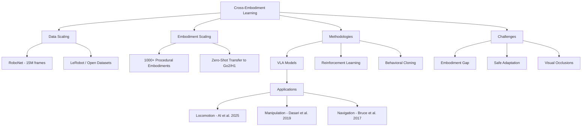

# Literature Review: Cross-Embodiment Robot Learning

**Date:** 2026-02-06
**Topic:** Cross-Embodiment Robot Learning

## 1. Introduction
The field of robot learning is undergoing a paradigm shift from specialized, single-robot controllers to generalist embodied agents. **Cross-embodiment robot learning** aims to develop models that can learn from diverse robotic platforms and generalize to new, unseen morphologies. This approach addresses the "data scarcity" problem in robotics by pooling experiences across different hardware setups, effectively creating "embodiment scaling laws" analogous to the scaling laws seen in Large Language Models (LLMs).

## 2. Key Methodology Trends
Based on recent ArXiv papers (2017-2025), several key methodology trends have emerged:

*   **Embodiment Scaling Laws:** Recent work by Ai et al. (2025) suggests that increasing the diversity of training embodiments (morphologies, kinematics, and joint-level variations) significantly improves zero-shot generalization to novel robots. This "embodiment scaling" is found to be more effective than simply increasing data for a fixed embodiment.
*   **Data-Driven Foundations:** There is a strong movement from classical model-based control to data-driven paradigms. Tutorial works (Capuano et al., 2025) highlight the use of Reinforcement Learning (RL), Behavioral Cloning (BC), and language-conditioned models (VLAs) as the backbone for cross-embodiment agents.
*   **Multi-Robot Databases:** The creation of shared databases like **RoboNet** (Dasari et al., 2019) has provided a foundational pool of millions of frames from diverse robot platforms, enabling pre-training and fine-tuning strategies that outperform robot-specific training.
*   **On-Policy Imitation and supervisors:** Methodology involving "converging supervisors" (Balakrishna et al., 2019) allows robots to learn from evolving experts, which is critical in dynamic cross-embodiment settings where the optimal controller might change.
*   **Efficient Exploration in Sparse Reward Scenarios:** Model-based policy search (Kaushik et al., 2018) remains a key component for data efficiency, especially when dealing with the high-dimensional spaces characteristic of complex robotic tasks.

## 3. Common Datasets
*   **RoboNet:** A large-scale database containing 15 million video frames from 7 different robot platforms (e.g., Franka, Kuka, Sawyer).
*   **LeRobot:** A modern library and dataset ecosystem (Capuano et al., 2025) providing ready-to-use examples for modern robot learning.
*   **Procedurally Generated Embodiments:** Modern research (Ai et al., 2025) utilizes simulation to generate thousands of unique robot morphologies (topological and geometric variations) to study scaling trends.

## 4. Open Challenges
*   **The "Embodiment Gap":** Effectively mapping high-level instructions to low-level control across radically different morphologies (e.g., from a quadraped to a robotic arm).
*   **Safety and Robustness:** Closing the safety-learning loop in interactive autonomy (Hu et al., 2023) to ensure that adaptive agents do not engage in unsafe behavior during the learning phase.
*   **Visual Homogeneity and Self-Occlusion:** Complex tasks like untangling knots (Grannen et al., 2020) remain difficult due to high-dimensional configuration spaces and visual ambiguity.
*   **Transfer to Real-World Variations:** Achieving reliable zero-shot transfer under real-world environmental variations without extensive fine-tuning (Bruce et al., 2017).

## 5. Relationship Diagram (Mermaid)

---
*Generated by the Literature Review Tool on 2026-02-06.*
