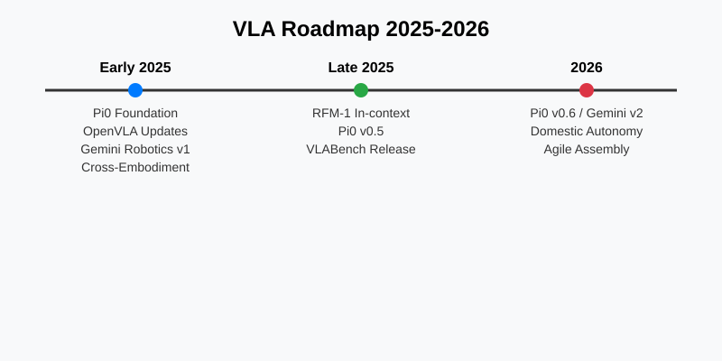

The field of robotics has been transformed by the emergence of **Vision-Language-Action (VLA)** models. These foundation models allow robots to understand complex instructions and execute actions in unstructured environments.

Based on recent research and market trends, we've mapped out the trajectory of VLA development from early 2025 through 2026.

### Key Milestones

#### 2025: The Year of Foundations
- **Pi0 (Physical Intelligence)**: Established the baseline for high-frequency flow-based control.
- **Cross-Embodiment Training**: Major datasets became standardized, allowing models to learn from diverse robot morphologies.
- **Gemini Robotics**: Google DeepMind integrated large multimodal models directly into low-level control loops.

#### Late 2025: Robustness and In-Context Learning
- **RFM-1**: Covariant's model showed that robots could learn new tasks via in-context prompting without full retraining.
- **Benchmarks**: VLABench and VLA-Risk became the industry standards for evaluating safety and generalization.

#### 2026: Domestic and Industrial Autonomy
- **Domestic Tasks**: Reliable laundry folding and meal preparation became a reality in lab settings and early pilot programs.
- **Agile Assembly**: Industrial robots moved away from fixed routines to VLA-guided adaptive assembly.

---
*Visualized by Pi based on Night Shift research logs.*
