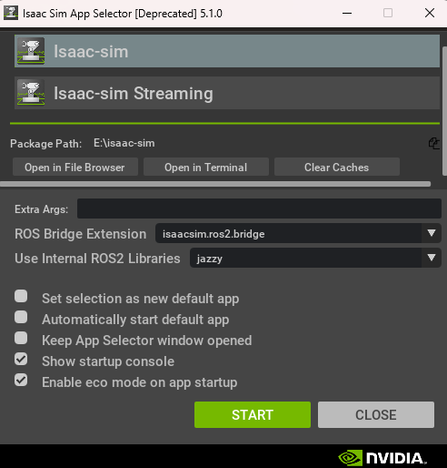
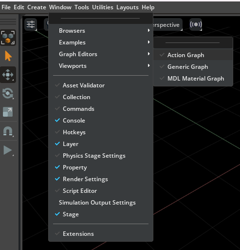
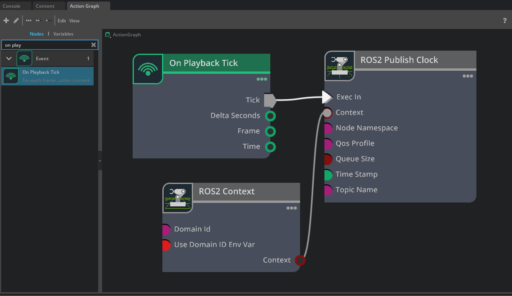
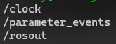

NVIDIA Isaac Sim provides a powerful simulation environment for robotics, and connecting it with ROS2 is essential for many workflows. This tutorial guide you through setting up the connection between Isaac Sim running on Windows 11 and ROS2 Jazzy running in WSL2.

## Environment Overview

Before starting, ensure your environment matches or is compatible with the following:

* **Host OS**: Windows 11
* **Simulation**: NVIDIA Isaac Sim (installed via Omniverse Launcher)
* **WSL**: Ubuntu 24.04 (WSL2)
* **ROS2 Version**: Jazzy Jalisco

***

## Step 1: WSL2 and ROS2 Setup

First, ensure ROS2 Jazzy is installed in your WSL2 Ubuntu environment by following the [official ROS2 Jazzy installation guide](https://docs.ros.org/en/jazzy/Installation.html).

### Configure Environment Variables

To allow ROS2 to communicate across the WSL2/Windows bridge and between different processes, you need to configure your shell environment. Add the following lines to the end of your `~/.bashrc` file:

```bash
# Source ROS2 Jazzy
source /opt/ros/jazzy/setup.bash

# Allow ROS2 to communicate beyond localhost
export ROS_LOCALHOST_ONLY=0

# Ensure matching Domain ID (Default is 0)
export ROS_DOMAIN_ID=0
```

After saving the file, refresh your current terminal:

```bash
source ~/.bashrc
```

***

## Step 2: Launching Isaac Sim

Isaac Sim handles ROS2 communication through a dedicated bridge extension.

1. Navigate to your Isaac Sim installation directory on Windows.
2. Run the launcher script: `isaac-sim.selector.bat`.
3. In the **App Selector** window:
    * Locate the **ROS Bridge Extension** dropdown.
    * Select `isaacsim.ros2.bridge`.
    * Ensure the version is set to **Jazzy**.
4. Press **START**.



***

## Step 3: Configuring the Action Graph

Once Isaac Sim is open, we need to create an Action Graph to publish a clock signal to ROS2. This serves as a simple verification that the bridge is working.

1. In the top menu, go to **Window** → **Graph Editors** → **Action Graph**.



2. Click **New Action Graph**.
3. In the search bar, find and add the following three nodes to the graph:
    * **On Playback Tick**: Triggers the graph execution on every simulation frame.
    * **ROS2 Context**: Provides the ROS2 environment for the publisher.
    * **ROS2 Publish Clock**: Sends the simulation time to the `/clock` topic.

### Connect the Nodes

Connect the nodes as follows:

* **On Playback Tick (Tick)** → **ROS2 Publish Clock (Exec In)**
* **ROS2 Context (Context)** → **ROS2 Publish Clock (Context)**



***

## Step 4: Final Test and Verification

Now it's time to verify that the communication is active.

1. In Isaac Sim, press the **Play** button (on the left toolbar).
2. Switch back to your **WSL2 terminal**.
3. Run the following command to list active ROS2 topics:

```bash
ros2 topic list
```

If the setup is successful, you should see `/clock` in the output:

```text
/clock
/parameter_events
/rosout
```



Congratulations! You have successfully established communication between Isaac Sim on Windows and ROS2 in WSL2. You are now ready to build more complex robotic simulations.